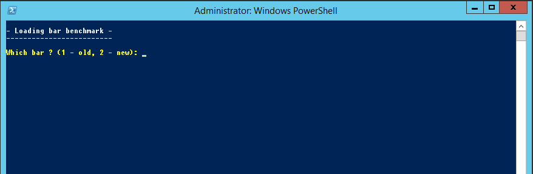
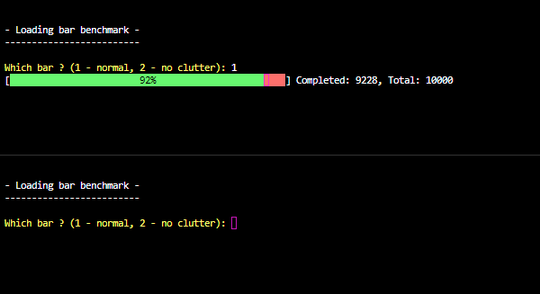

# Do-Progress
Do-Progress is a visual loading bar for Windows Powershell



**Usage**

1. Clone this repository

2. Import the Module or paste the Do-Progress function into your code
```powershell
Import-Module Do-Progress
```

3. Usage
```powershell
Do-Progress $completed $total $started
```
$started is optional.

4. Example usage
```powershell
$total = 10000
$count = 0
$started = 0

while ($count -ne $total) {
    $count++
    if ($started -lt $total) {
        $started += 2
        if ($started -gt $total) {
            $started = $total
        }
    }
    Do-Progress $count $total $started
}
```

**NoClutter Mode**

The -NoClutter mode can be used to have a loading bar with no stats.
This mode has been made 100x more efficient, and will significantly speed up large jobs.

```powershell
Do-Progress $completed $total -NoClutter
```
